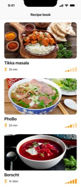

# 🍳 Recipies

**Your personal recipe book — all your recipes in one place, always at hand, no internet required.**

---

Recipies is an offline-first iOS app for building and browsing your personal collection of cooking recipes. Unlike saving links to websites that may disappear or require a login, your recipes live entirely on your device — written by you, in the format you want. The app is designed to feel at home in the kitchen: clear layout, large text where it counts, and a dedicated cooking mode that keeps your hands free and your screen on.

## Features

**📵 Fully offline** — All data is stored locally on your device. No account, no cloud, no internet connection needed — ever.

**✍️ Your own recipes** — Write recipes from scratch: ingredients, steps, photos, notes. Structured just the way you think about cooking.

**👨‍🍳 Cooking mode** — Step-by-step full-screen view with large text, per-step ingredients, and timers. Screen stays on while you cook. Navigate steps with a swipe or from Apple Watch.

**📤 Easy sharing** — Share recipes as self-contained `.recipe` files (a zip with JSON + images). Send over iMessage, AirDrop, or email — anyone with the app can open them instantly.

## Screens

  
  &nbsp;&nbsp;&nbsp;&nbsp;
  

  Recipe list &nbsp;&nbsp;&nbsp;&nbsp;&nbsp;&nbsp;&nbsp;&nbsp;&nbsp;&nbsp;&nbsp;&nbsp;&nbsp;&nbsp;&nbsp;&nbsp;&nbsp;&nbsp;&nbsp;&nbsp; Recipe detail

## Cooking Mode

Designed for real kitchen conditions:

- One step per screen, full-screen layout
- Large, easy-to-read text
- Per-step ingredient list
- Built-in step timer
- Screen stays on while cooking
- Navigate with Apple Watch

## Sharing

Recipes are exported as `.recipe` files — a zip archive containing the recipe JSON and all photos. Recipients open the file directly in the app. No setup, no account, no server.

---

> **In development** — App Store release planned for fall 2026.
